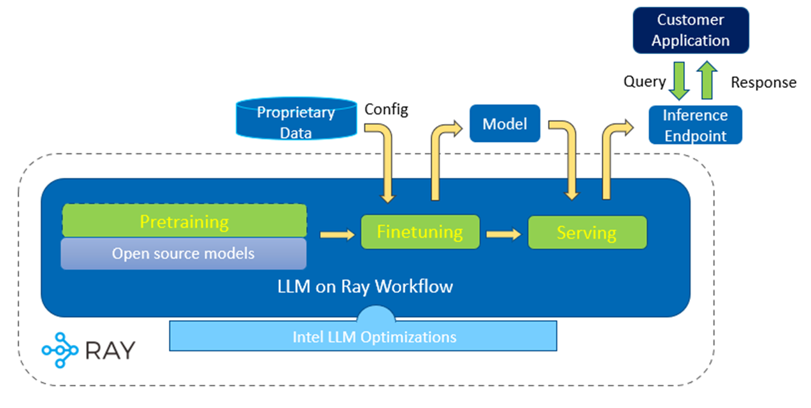

# LLM-on-Ray

## Introduction
LLM-on-Ray is a comprehensive solution designed to empower users in building, customizing, and deploying Large Language Models (LLMs). Whether you're starting from scratch with pretraining, looking to finetuning an existing model, or aiming to deploy a production-ready LLM endpoint service, this project simplifies these complex processes into manageable steps.

LLM-on-Ray harnesses the power of Ray, an industry-leading framework for distributed computing, to scale your AI workloads efficiently. This integration ensures robust fault tolerance and cluster resource management, making your LLM projects more resilient and scalable.

LLM-on-Ray is built to operate across various hardware setups, including Intel CPU, Intel GPU and Intel Gaudi2. It incorporates several industry and Intel optimizations to maximize performance, including [vLLM](https://github.com/vllm-project/vllm), [llama.cpp](https://github.com/ggerganov/llama.cpp), [Intel Extension for PyTorch](https://github.com/intel/intel-extension-for-pytorch)/[DeepSpeed](https://github.com/intel/intel-extension-for-deepspeed), [IPEX-LLM](https://github.com/intel-analytics/ipex-llm), [RecDP-LLM](https://github.com/intel/e2eAIOK/tree/main/RecDP/pyrecdp/LLM), [NeuralChat](https://huggingface.co/Intel/neural-chat-7b-v3-1) and more.

## Solution Technical Overview
LLM-on-Ray's modular workflow structure is designed to comprehensively cater to the various stages of LLM development, from pretraining and finetuning to serving. These workflows are intuitive, highly configurable, and tailored to meet the specific needs of each phase in the LLM lifecycle:

* **Pretraining Workflow**: Provides the infrastructure to build LLMs from scratch.
    * **Data Preparation**: Includes a suite of tools for preparing your training data which facilitate tasks like the removal of Personally Identifiable Information (PII), data deduplication (Dedup), and other preprocessing needs, making the data safe and efficient for training.
    * **Megatron-DeepSpeed Integration**: Leverages the power of Megatron-DeepSpeed to enable advanced capabilities such as pipeline parallelism, tensor parallelism, data parallelism, and Zero Redundancy Optimizer (ZeRO). This integration facilitates efficient and scalable model training from the ground up.
    * **Robust Fault Tolerance**: Offers automatic fault tolerance powered by Ray. This ensures high availability, reliability, and optimal performance for large scale pretraining.


* **Finetuning Workflow**: Supports refinement of pre-trained models with proprietary or specialized data, improving models' accuracy and applicability to various use cases.
    * **Ease of Customization**: Users can easily configure the base model and resource allocation for the training job, customize training parameters to fit their specific needs. This can be accomplished through a simple command line or via the Web UI.
    * **Parameter Efficient Finetuning**: Supports various parameter efficient finetuning methods such as LoRA to accelerate the finetuning process.
    * **Reinforcement Learning with Human Feedback (RLHF)**: Users can further refine the model using RLHF, which leverages the proximal policy optimization (PPO).

* **Serving Workflow**: Deploys a scalable and production-ready LLM serving endpoint.
    * **Easy Deployment of Models**: Supports the deployment of both widely-used open-source models and custom finetuned models through flexible configurations.
    * **Autoscaling and Scale-to-Zero Capabilities**: Ensures high efficiency and cost-effectiveness in model deployment. The workflow can dynamically scale resources to match demand and scale down to zero when the model is not in use, optimizing resource usage and reducing operational costs.
    * **Optimized for Performance and Efficiency**: LLM-on-Ray incorporates several optimizations to maximize performance. This includes support for various precision levels and the utilization of advanced optimization techniques from Intel, ensuring efficient processing and reduced resource consumption.
    * **OpenAI-Like REST API**: Provides APIs similar to OpenAI's, making it easier for users to transition to or integrate open-source models into their systems.

* **Interactive Web UI for Enhanced Usability**: Except for command line, LLM-on-Ray introduces a Web UI, allowing users to easily finetune and deploy LLMs through a user-friendly interface. Additionally, the UI includes a chatbot application, enabling users to immediately test and refine the models.





## Getting Started
This guide will assist you in setting up LLM-on-Ray on Intel CPU locally, covering the initial setup, finetuning models, and deploying them for serving.
### Setup

#### 1. Clone the repository, install llm-on-ray and its dependencies.
Software requirement: Git and Conda
```bash
git clone https://github.com/intel/llm-on-ray.git
cd llm-on-ray
conda create -n llm-on-ray python=3.9
conda activate llm-on-ray
pip install .[cpu] --extra-index-url https://download.pytorch.org/whl/cpu --extra-index-url https://pytorch-extension.intel.com/release-whl/stable/cpu/us/
```

#### 2. Start Ray
__[Optional]__ If DeepSpeed is enabled or doing distributed finetuing, oneCCL and Intel MPI libraries should be dynamically linked in every node before Ray starts:
```bash
source $(python -c "import oneccl_bindings_for_pytorch as torch_ccl; print(torch_ccl.cwd)")/env/setvars.sh
```

Start Ray locally using the following command. To launch a Ray cluster, please follow the [setup](docs/setup.md) document.
```bash
ray start --head
```

### Finetuning
Use the following command to finetune a model using an example dataset and default configurations. The finetuned model will be stored in `/tmp/llm-ray/output` by default. To customize the base model, dataset and configurations, please see the [finetuning document](#finetune):

```bash
llm_on_ray-finetune --config_file llm_on_ray/finetune/finetune.yaml
```

### Serving
Deploy a model on Ray and expose an endpoint for serving. This command uses GPT2 as an example, but more model configuration examples can be found in the [inference/models](inference/models) directory:

```bash
llm_on_ray-serve --config_file llm_on_ray/inference/models/gpt2.yaml
```
You can also use model_ids to serve directly through:
```bash
llm_on_ray-serve --models gpt2
```
List all support model_ids with config file path:
```bash
llm_on_ray-serve --list_model_ids
```
The default served method is to provide an OpenAI-compatible API server ([OpenAI API Reference](https://platform.openai.com/docs/api-reference/chat)), you can access and test it in many ways:
```bash
# using curl
export ENDPOINT_URL=http://localhost:8000/v1
curl $ENDPOINT_URL/chat/completions \
    -H "Content-Type: application/json" \
    -d '{
    "model": "gpt2",
    "messages": [{"role": "system", "content": "You are a helpful assistant."}, {"role": "user", "content": "Hello!"}],
    "temperature": 0.7
    }'

# using requests library
python examples/inference/api_server_openai/query_http_requests.py

# using OpenAI SDK
pip install openai>=1.0
export OPENAI_BASE_URL=http://localhost:8000/v1
export OPENAI_API_KEY="not_a_real_key"
python examples/inference/api_server_openai/query_openai_sdk.py
```
Or you can serve specific model to a simple endpoint according to the `port` and `route_prefix` parameters in configuration file,
```bash
llm_on_ray-serve --config_file llm_on_ray/inference/models/gpt2.yaml --simple
```
After deploying the model endpoint, you can access and test it by using the script below:
```bash
python examples/inference/api_server_simple/query_single.py --model_endpoint http://127.0.0.1:8000/gpt2
```

## Documents
The following are detailed guidelines for pretraining, finetuning and serving LLMs in various computing environment.

### Pretraining:
* [Pretrain LLMs on Intel Gaudi](docs/pretrain.md)

### <a name="finetune"></a> Finetuning:
* [Finetune LLMs on Intel CPU or GPU](docs/finetune.md)
* [Reinforcement Learning with Human Feedback](docs/rlhf.md)

### Serving
* [Deploy and Serve LLMs on Intel CPU/GPU/Gaudi](docs/serve.md)
* [Deploy and Serve LLMs with DeepSpeed](docs/serve_deepspeed.md)
* [Deploy and Serve LLMs with IPEX-LLM](docs/serve_ipex-llm.md)

### Web UI
* [Finetune and Deploy LLMs through Web UI](docs/web_ui.md)

## Disclaimer
To the extent that any public datasets are referenced by Intel or accessed using tools or code on this site those datasets are provided by the third party indicated as the data source. Intel does not create the data, or datasets, and does not warrant their accuracy or quality. By accessing the public dataset(s), or using a model trained on those datasets, you agree to the terms associated with those datasets and that your use complies with the applicable license.

Intel expressly disclaims the accuracy, adequacy, or completeness of any public datasets, and is not liable for any errors, omissions, or defects in the data, or for any reliance on the data.  Intel is not liable for any liability or damages relating to your use of public datasets.
