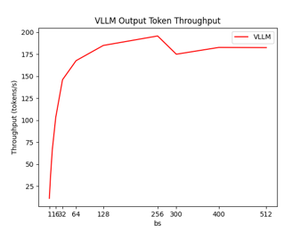

The `benchmark_visualize.py` script is designed for visualizing benchmark results and generate figures. The performance data it uses comes from the results generated by `run_benchmark.sh`. Two modes are supported when generating performance data, namely "test" and "benchmark". "test" only selects a small part of dataset, allowing users to view the generated figures quickly. Then please choose "benchmark" mode to get normalized results.
### Command
```bash
# step 1: start ray cluster
# start head node on a machine
numactl -N 0 -m 0 ray start --head --include-dashboard False --num-cpus 0
# start worker nodes on another machine (please configure 27cores * 4replicas in config file accordingly)
numactl -N 0 -m 0 -C 0-55 ray start --address='$HEAD_NODE_IP:PORT' --num-cpus 56
numactl -N 1 -m 1 -C 56-111 ray start --address='$HEAD_NODE_IP:PORT' --num-cpus 56
# step 2: generate performance results
bash benchmarks/run_benchmark.sh 1,2,3,4 "benchmark"
# step 3: generate figure based on results
python benchmarks/benchmark_visualize.py
```
Visualize script supports the generation of four scenes. They will all be generated by default. You can set choice parameter to get specified figures.
```bash
choice=1
# choice=1,2,3
bash benchmarks/run_benchmark.sh $choice "benchmark"
python benchmarks/benchmark_visualize.py --choice $choice
```
### Generated results of different Choices
- Choice 1: the peak output token throughput of llm-on-ray with vllm
    
    This choice will get output token throughput according to different batch_size, then we can get the peak data clearly based on this figure.

    

- Choice 2: compare output token throughput(average latency per token) between llm-on-ray with vllm and llm-on-ray
    
    This choice will generate two figures, one compares the output token throughput between llm-on-ray with vllm and llm-on-ray(sample figure), and the other compares the average latency per token. From these two figures, we can conclude that vllm has a significant improvement of inference performance as batch_size increases.

    
    
- Choice 3: latency vs throughput tradeoff for various number of requests

    According to the results generated by this choice, we can determine the maximum number of requests based on limited latency and throughput. The results of two sets of parameters will be generated, input token length/output token length of the one is 32/64(sample figure) and the other is 1024/128.

    

- Choice 4: get the latency of llm-on-ray with vllm

    This choice will list the latecy(first token latecy and next token latency) for different input token length.
    ```bash
    Results:
    input_tokens_length: [32, 128]
    avg_latency_first_token: [0.897, 1.3145]
    avg_latency_next_token: [0.383, 0.39]
    ```