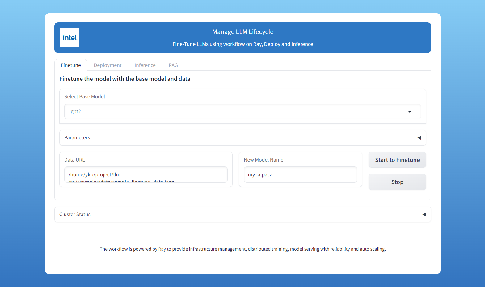
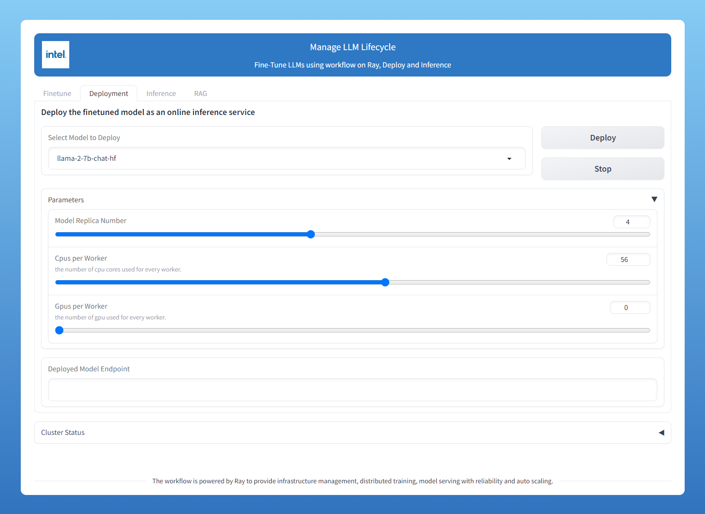
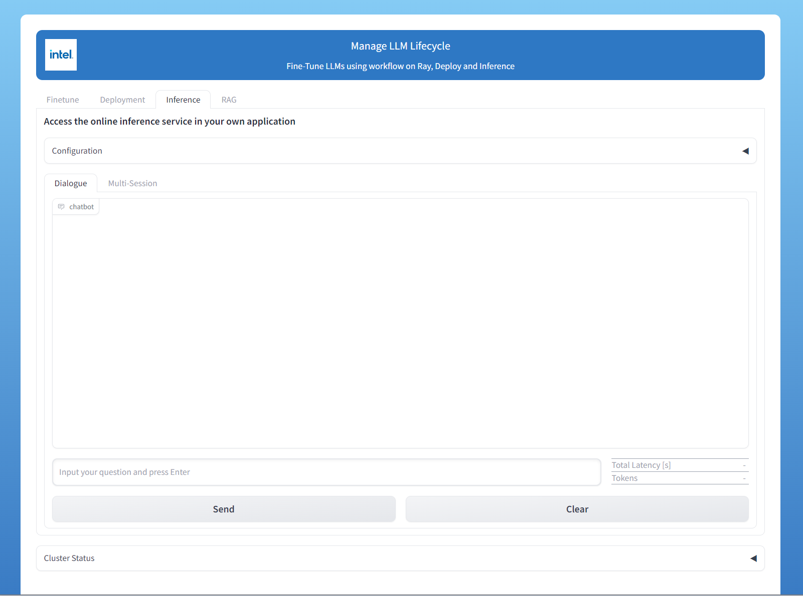

# Finetune and Deploy LLMs through Web UI

LLM-on-Ray introduces a Web UI, allowing users to easily finetune and deploy LLMs through a user-friendly interface. Additionally, the UI includes a chatbot application, enabling users to immediately test and refine the models.

## Setup
Please follow [setup.md](setup.md) to setup the base environment first.

## Setup UI Environment
After activating the environment installed from the previous step, please run the following script to install environment for Web UI.
```bash
dev/scripts/install-ui.sh
```

## Start Web UI

```bash
python -m llm_on_ray.ui.start_ui --node_user_name $user --conda_env_name $conda_env --master_ip_port "$node_ip:6379"
```
You will get URL from the command line output (E.g. http://0.0.0.0:8080 for local network and https://180cd5f7c31a1cfd3c.gradio.live for public network) and use the web browser to open it.

## Finetune LLMs
On the `Finetune` tab, you can configure the base model, finetuning parameters, the dataset path and the new model name. Click `Start To Finetune` to start finetuning.




## Deploy and Serve LLM
On the `Deployment` tab, you can choose a model to deploy, configure parameter `Model Replica Number`, `Cpus per Worker` and `Gpus per Worker`. Click `Deploy` and you will get a model endpoint.




## Chatbot
On the `Inference` tab, you can now test the model by asking questions.




